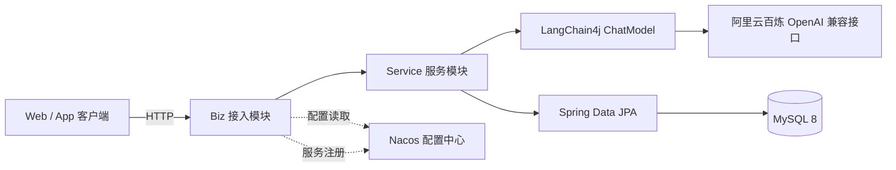

# 技术架构

## 1. 总体架构



## 2. 模块依赖

```text
biz
  ├── service
  └── common

service
  └── common
```

依赖方向始终由上层向下层，禁止反向依赖。

## 3. 技术选型

| 分类 | 技术 | 版本 | 说明 |
| --- | --- | --- | --- |
| 语言 | Java | 17 | LTS 版本 |
| 构建 | Maven | 3.9+ | 多模块构建 |
| 基础框架 | Spring Boot | 3.2.12 | Web、JPA、校验 |
| 微服务组件 | Spring Cloud Alibaba | 2023.0.3.4 | Nacos 配置与注册 |
| AI 框架 | LangChain4j | 1.18.1 | 模型调用与消息抽象 |
| 模型接入 | langchain4j-open-ai | 1.18.1 | 阿里云 OpenAI 兼容模式 |
| AI Service | langchain4j-spring-boot-starter | 1.18.1-beta28 | @AiService 注解与代理生成 |
| 横切能力 | Spring AOP | 随 Boot | 对话消息统一登记 |
| 向量数据库 | Pinecone | langchain4j-pinecone | FAQ 知识库向量检索 |
| 数据库 | MySQL | 8.0 | 对话数据持久化 |
| ORM | MyBatis-Plus | 3.5.17 | 实体映射与 Mapper 数据访问 |
| 测试 | JUnit 5 / Mockito | 随 Boot | 单元与接口测试 |
| 测试数据库 | H2 | 随 Boot | 本地内存数据库 |

## 4. 关键链路

1. 客户端调用 `POST /api/v1/chat`。
2. Biz 层校验参数后调用 Service 层。
3. Service 层调用由 `@AiService` 生成的智能客服代理，模型通过 Tool 查询历史上下文，并通过 RAG 检索 Pinecone 知识库。
4. AOP 切面将用户消息与 AI 回复写入 MySQL。
5. 统一返回结构 `Result` 返回给客户端。

## 5. 配置管理

- 本地 `application.yml` 仅保留应用名、Nacos 地址与配置导入入口。
- 数据源、模型参数、JPA 等运行配置存放在 Nacos 的 `langchain4j-demo.yaml`。
- Nacos 配置支持热刷新，后续可结合 `@RefreshScope` 实现无重启更新。
